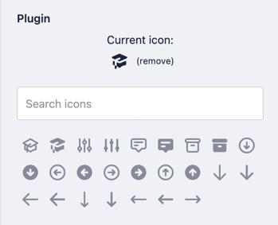

# Storyblok Field-Type Heroicons


This field-type allows users to choose icons with each of the available icon styles from [Heroicons](https://heroicons.com/).

Name | Description                            | Author
------------ |----------------------------------------| -------------
Heroicons | Allows users to select any heroic icon | [Jean-Philippe Kha](https://github.com/jpkha)


## Usage

Select the desired style, and search/filter for your desired icon. You have access to the solid and outline Heroicons.

Returns an object with the class and icon name:
```
{
  "plugin": "heroicon",
  "icon": "<icon name>",
  "svgIcon": "<svg path>",
  "type": "heroicon-outline | heroicon-solid",
  ...
}
```
Example : 
```
{
  "plugin": "heroicon",
  "icon": "annotation",
  "svgIcon": "<svg xmlns=\"http://www.w3.org/2000/svg\" fill=\"none\" viewBox=\"0 0 24 24\" stroke=\"currentColor\"><path stroke-linecap=\"round\" stroke-linejoin=\"round\" stroke-width=\"2\" d=\"M7 8h10M7 12h4m1 8l-4-4H5a2 2 0 01-2-2V6a2 2 0 012-2h14a2 2 0 012 2v8a2 2 0 01-2 2h-3l-4 4z\"/></svg>",
  "type": "heroicon-outline",
  ...
}
```

## Output - Use the icon name 

You can load the script :
```
<script src="https://unpkg.com/hero-icon-js/hero-icon-outline.js"></script>
<script src="https://unpkg.com/hero-icon-js/hero-icon-solid.js"></script>
```
Then use the icon name from Heroic Icon object :
```
<hero-icon-outline name="{blok.icon}"></hero-icon-outline>
<hero-icon-solid name="{blok.icon}"></hero-icon-solid>
```

## Output - Use svg Icon path
By using svgIcon you can have the source of the svg, so you don't need to load any resources to display it

Exemple in Vue.js
```
<span v-html="svgIcon"></span>
```

Exemple in Angular
```
<div [innerHTML]="svgIcon"></div>
```

Exemple in React
```
<span dangerouslySetInnerHTML={{__html: svgIcon}}></span>
```

## Styling Svg icon

You can style your icon by using class or style with Height, Width, Color property for example.
```
<span style="height: 24px; width: 24px; color: blue; display: inline-block" v-html="getSvg(model)"></span>
```
